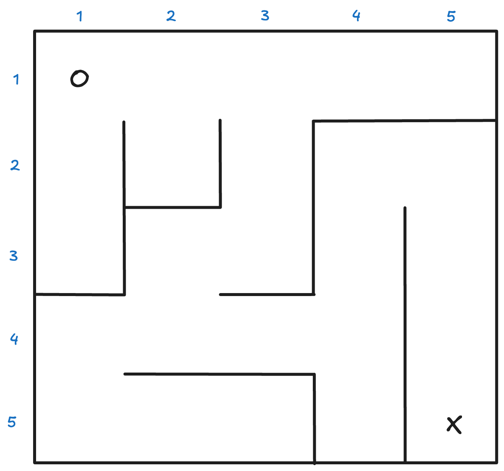
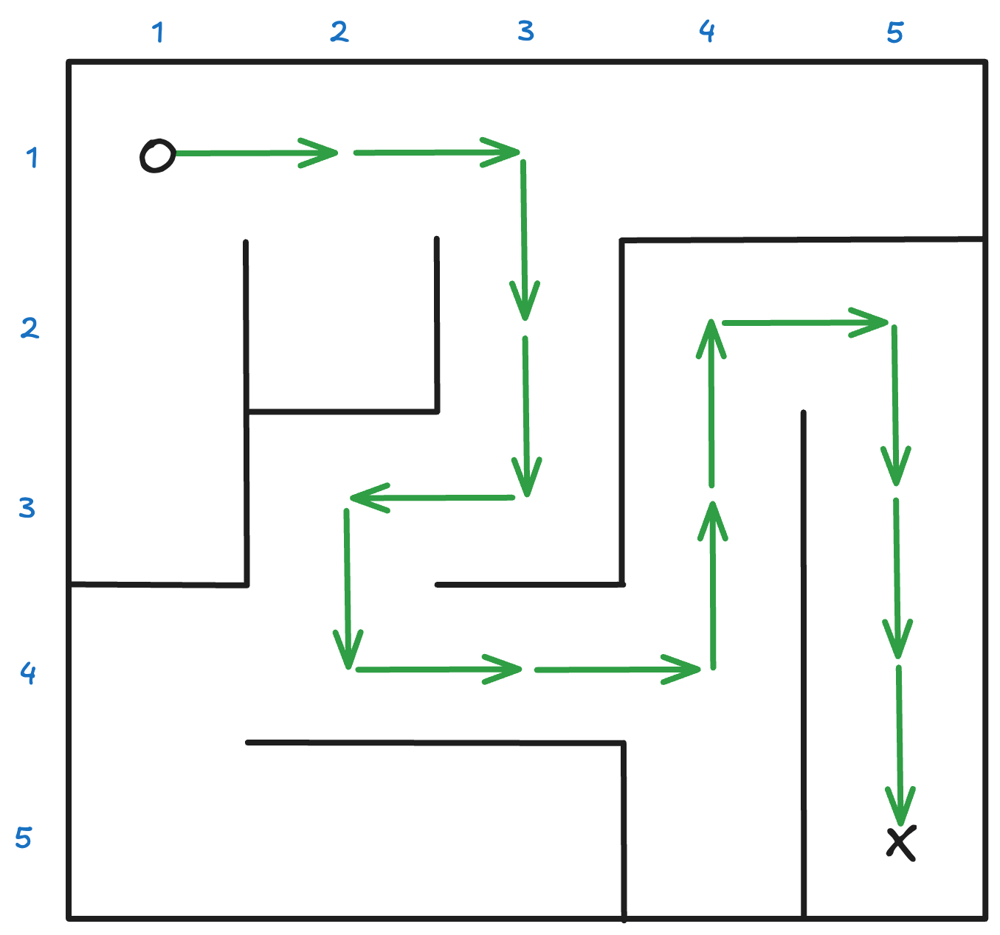
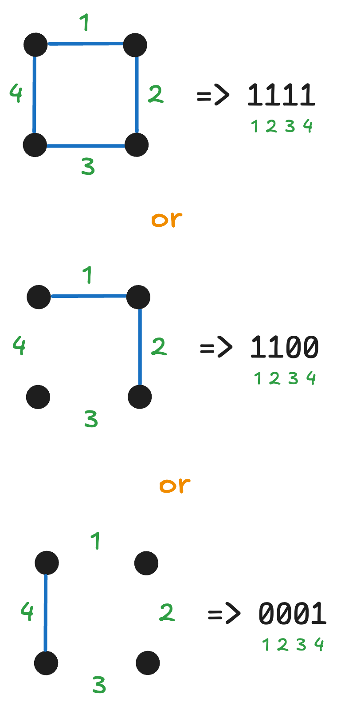
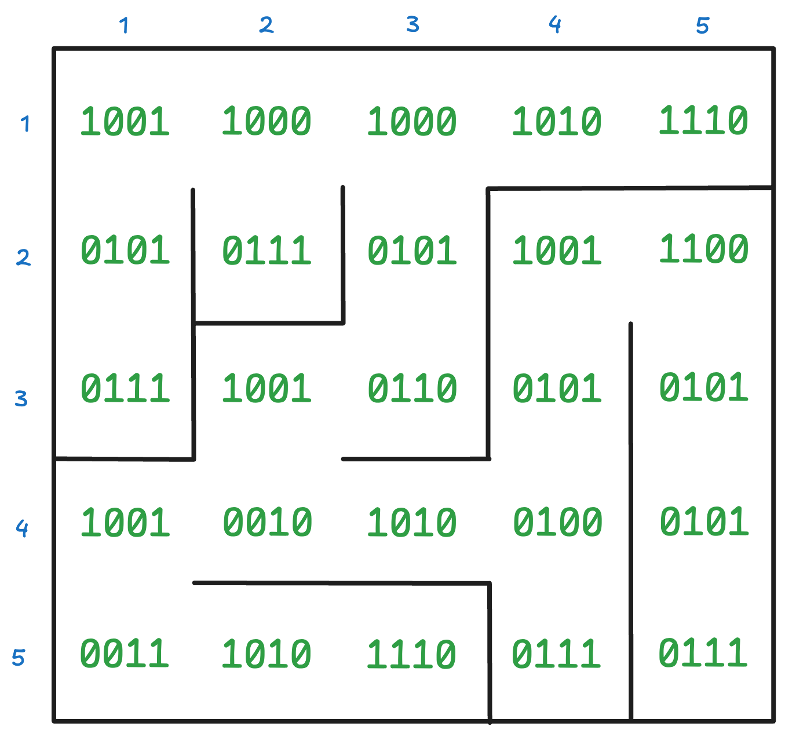
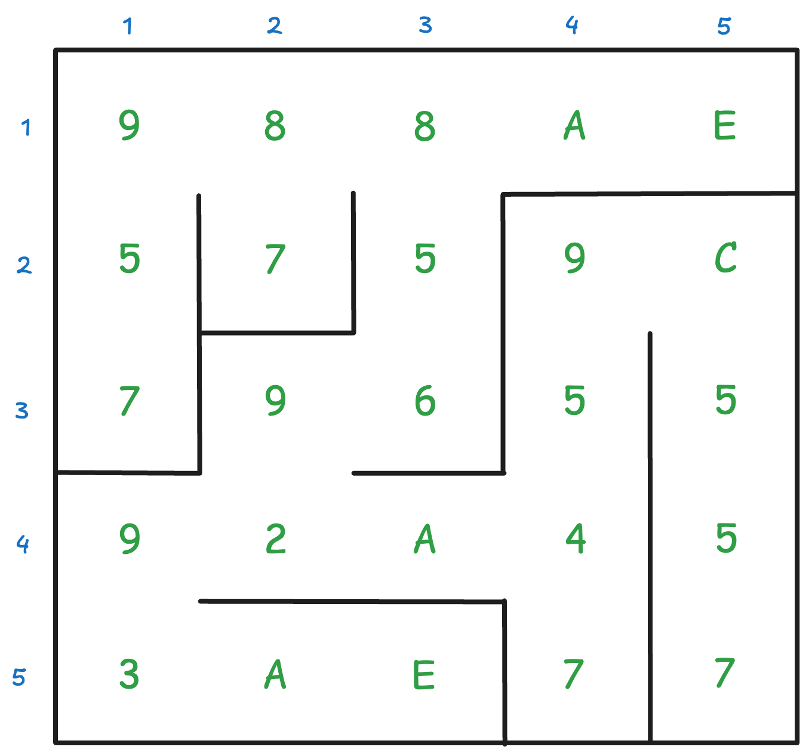

## 🌽 A-Maze-ing

 You love a good maze... In fact, you think it's a skill that you can teach
 anyone else to also appreciate!

 With your extensive Solidity programming skills, deploy a smart contract that
 can quickly determine if the maze path you provided will get you from the start
 to the end.
 
 Here's some example code to get you started:

 ```solidity
//SPDX-License-Identifier: Unlicense
pragma solidity ^0.8.0;

contract MazeFinder {

    /// Check if the provided path will navigate you from the start of the maze
    /// (located at the top-left) to the end (bottom-right) of the maze.
    ///
    /// @param maze (bytes) is a hexadecimal encoding of a maze
    /// @param path (string) is a series of instructions to navigate the maze
    /// @return isValid True if a valid maze path is provided
    function isValidPath(bytes calldata maze, string calldata path)
        public
        pure
        returns (bool isValid)
    {   
        // TODO: Add logic here

        return isValid;
    }
}
 ```

## What does a `path` look like?

Easy, it's a `string` where each character is a direction for where you should
move to next in the maze. `U` = up, `D` = down, `R` = right, and `L` is left.

For example:

```solidity
string path = "RRDL..."
```

Instructs you to move Right, Right, Down, Left, etc...

## How do you encode a maze into `bytes`?!?!

That's a good question 😅, and here's the general idea...

Each maze can actually be broken down into a grid of _"squares"_ , where each
_square_ can have up to 4 edges. Here, let's look at a visual example 🧑‍🏫:



This is a simple 5x5 maze with a start (`O`) and end (`X`) on opposite ends. One
solution to this maze _could_ be `RRDDLDRRUURDDD`



Now let's look at each square in the 1st row a little closer. We can represent
each square as 4 bits based on the edges it has (or doesn't have) starting at
the top going clockwise. Some examples:



This means the maze becomes...



Then take these 4-bit values and convert them to hexadecimal chars...



Concatenate the hex chars from left to right, top-down you get:

```
988AE5759C7965592A453AE77
```

HOWEVER, only an even number of characters is considered a valid hexadecimal
string. So the final hex encoding is:

```
0x0988AE5759C7965592A453AE77
```

## What are some edgecases to consider?

- Running into a wall of the maze is considered an invalid move and should always
return `False`

<details>
  <summary>Hint #1</summary>
  
  For simplicity, assume the following:
  
  - The maze will always be of size 5x5
  - The maze is always solvable
  - The path is less than 100 characters long
</details>

<details>
  <summary>Hint #2</summary>
  
  Always write unit tests to validate your logic. Here's a few Hardhat tests to
  get you started:

  ```typescript
import { expect } from 'chai';
import { getWallet, deployContract, LOCAL_RICH_WALLETS } from '../../deploy/utils';
import { Contract } from 'ethers';

describe('MazeFinder', function () {
  const wallet = getWallet(LOCAL_RICH_WALLETS[0].privateKey);
  let mazeFinder: Contract;
  
  before(async function () {
    mazeFinder = await deployContract("MazeFinder", [], { wallet, silent: true });
  });
  
  it("Should return true for valid minimal path", async function () {
    const isValid: boolean = await mazeFinder.isValidPath(
      "0x0988AE5759C7965592A453AE77",
      "RRDDLDRRUURDDD"
    );
    expect(isValid).to.be.true;
  });
  
  it("Should return false if immediately run into a wall", async function () {
    const isValid: boolean = await mazeFinder.isValidPath(
      "0x0988AE5759C7965592A453AE77",
      "U"
    );
    expect(isValid).to.be.false;
  });
  
  it("Should return true for paths that backtrack", async function () {
    const isValid: boolean = await mazeFinder.isValidPath(
      "0x0988AE5759C7965592A453AE77",
      "RRRRLLDDLDRRUURDDD"
    );
    expect(isValid).to.be.true;
  });
});
  ```
</details>
