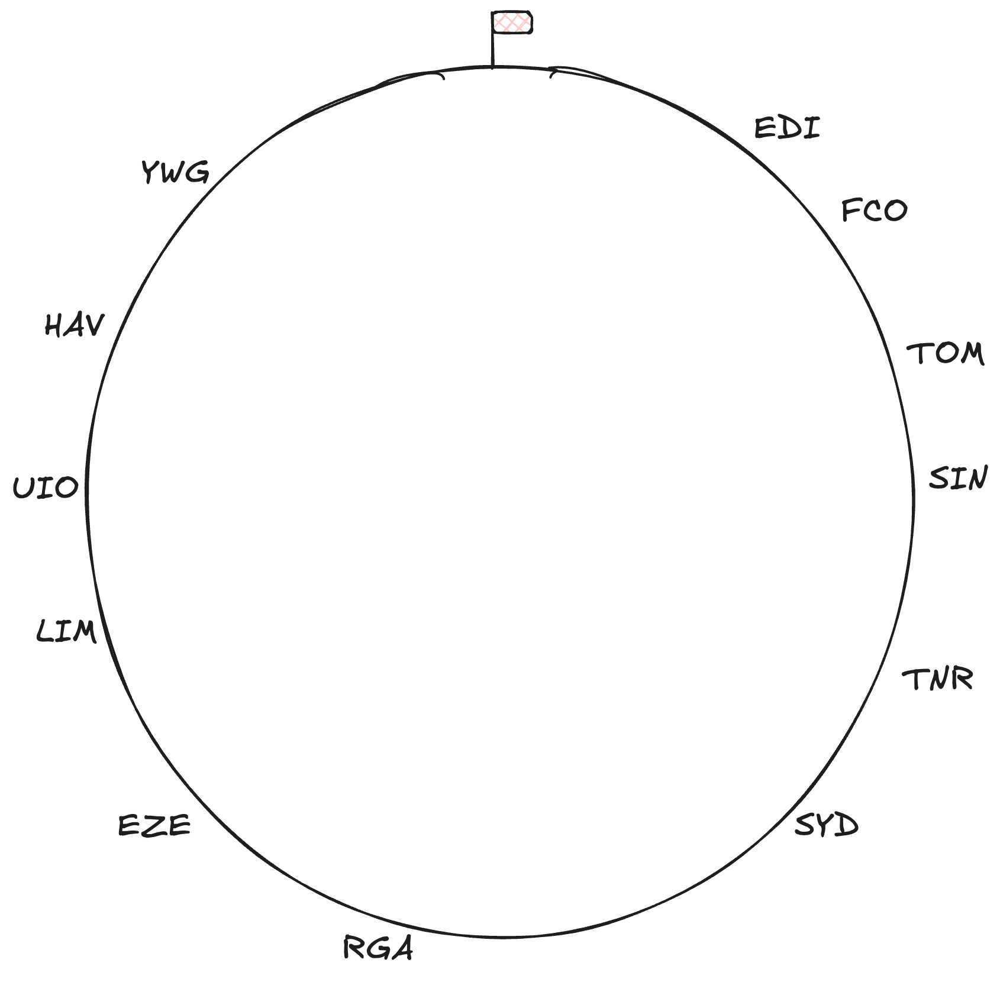

## ✈️ AmaZKing Race

> "Hello and welcome to the Amazing Race, the extreme challenge gameshow for
adventurers from around the world!" --Jeff

You and your team of 4 (including you) line up at the starting line, awaiting
your first challenge.

Jeff, the show's host, walks to each team and hands you each a sealed envelope.

> "Get ready, the world is waiting for you. Good luck. Travel safe. Go!"

You rip open the letter and see the following clues:

## Clue #1

Each team member has been given an ethereum wallet. It's your job to find the
final location of today's challenge and be the first team there!

You've been split into 2 teams:

### Team 1

Alice (You): `0xBC989fDe9e54cAd2aB4392Af6dF60f04873A033A`

Bob: `0x55bE1B079b53962746B2e86d12f158a41DF294A6`

### Team 2

Charlie: `0xCE9e6063674DC585F6F3c7eaBe82B9936143Ba6C`

Denice: `0xd986b0cB0D1Ad4CCCF0C4947554003fC0Be548E9`

To help you on your journey AROUND THE WORLD, feel free to use [ZK Airlines](https://sepolia.explorer.zksync.io/address/0x327c77b741b710b4ddE1B7fA56aeB2D77299Bb0e)! In fact, your
tickets have already been pre-booked 😉

As your team may **cross** paths on your journey AROUND THE WORLD, your
**intersections** might just point you in the correct direction. Connect the
dots, and you will find the way. But be warned, the final location is definitely
NOT cold.

When you think you've solved this puzzle, send the location to the Production
crew so we can book your tickets to victory.

⚠️Careful, the last team to discover the final location will be eliminated

## Clue #2

