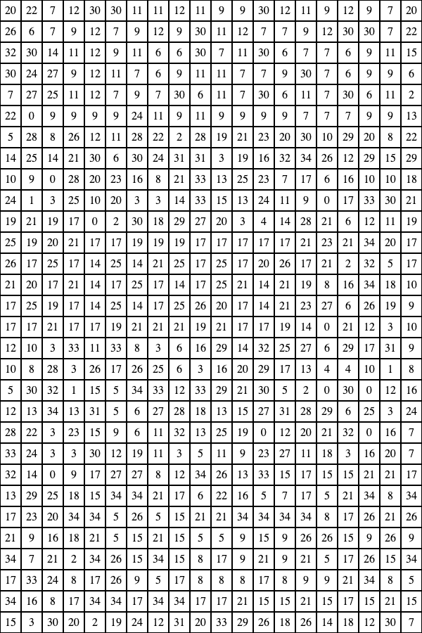

## 🎨 Paint By Numbers

Welcome to this edition of ETH Monthly Painting Club!

This month's painting contest is a paint-by-numbers (find the image attached
below 👇)!

But, where is the color key? How can I paint by numbers if I don't know what
colors go to which number??

This month's instructor has gone the extra mile and hidden the mapping of
numbers to colors somewhere, but all they said was:

> "The colors are inside Vitalik's Ethereum address... find all 35 colors within
the 40 character address. You're on the right track if Color 10 is a vibrant
shade of red and Color 8 is a shade of blue."

As always, to win the contest you must first send us your finished
painting and the hidden 3-word secret passphrase. Good luck and happy painting!

